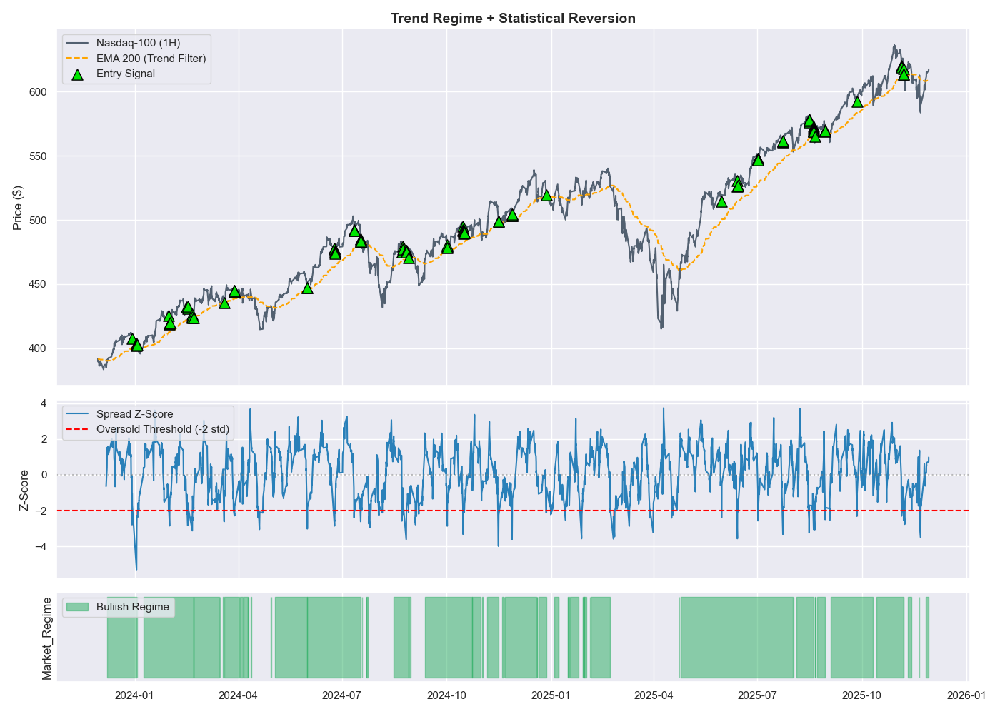

# nq-es-spread-analysis
# Statistical Arbitrage Strategy: Nasdaq-100 vs S&P 500

## Project Overview
This project implements a trading strategy that exploits the statistical correlation between the **Technology Sector (Nasdaq-100)** and the **Broad Market (S&P 500)**. 

The algorithm automates the decision-making process by combining **Higher Timeframe Trend Analysis** with **Lower Timeframe Statistical Anomalies**, removing emotional bias from trade execution.

## The Logic 
Unlike traditional technical analysis, this model relies on math and probability:

1.  **Risk Management (Regime Filter):** * Calculates a dynamic **200-period EMA** trend filter on the 4H timeframe.
    * **Logic:** If the market structure is Bearish, trading is disabled. This acts as a "Falling Knife Protection" mechanism.

2.  **Opportunity Detection (Z-Score):** * Calculates the relative spread ratio between QQQ and SPY.
    * Normalizes the spread using a **Rolling Z-Score (Window=40)**.
    * **Signal:** Entries are triggered only when Tech is statistically oversold (> 2 Standard Deviations) relative to the S&P 500.

## Tech Stack
* **Python:** Core logic and vectorization.
* **Pandas:** Time-series resampling and forward-filling data.
* **Statsmodels/NumPy:** Statistical calculations (Z-Score, Standard Deviation).
* **Seaborn/Matplotlib:** Data visualization.

## Performance Visualization
The chart below demonstrates the strategy's precision. Note the **empty zones in the bottom panel** (e.g., April 2024 correction) where the algorithm correctly identified a broken trend and paused trading to preserve capital.

